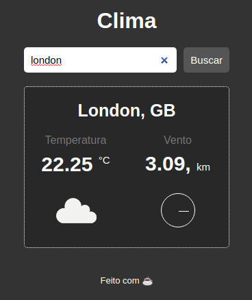

<h1 align="center">
    D7JS_WEATHER_BASE
</h1>

    

## 📝 About this project

This project an weather search very usefull and integrated with [Open Weather Map](https://openweathermap.org/) databese.

## 🔧 Build

This project can by make with API from Open Weather Map

For use it to, just created an account for get you API key and add follow endpoint in your code.

<pre><code>api.openweathermap.org/data/2.5/weather?q={city name}&appid={API key}</code></pre>

To about more check official documentation [docs](https://openweathermap.org/current)

### OBS: Some cases after create account API needed wait 24h to acctivate, if happen then go get an cup of coffee ok? ☕ 😉

---

## 🚀 How to use it

- Download or clone this repository from your computer

<pre><code>git clone https://github.com/Jeferson1/D7JS_WEATHER_BASE.git</code></pre>

- Create config.js file in root directory an insert your API key variable

<pre><code>const API_KEY = 'your_api_key_here';
export {API_KEY};</code></pre>

- Run index HTML in your favorite browser

# And have a nice day 🌤️
